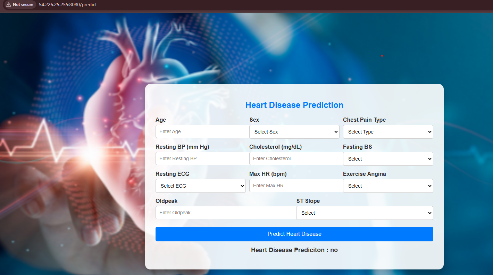

# Heart Disease Prediction with AWS CI/CD


## Overview
Predicting heart disease enables clinicians and patients to identify risks early and take preventive action. This repository contains a machine learning solution that trains a classification model on patient attributes and demonstrates how to deploy it to AWS using a CI/CD pipeline.

## Dataset
The training data resides in `notebook/data/heart.csv` and combines 918 observations from multiple heart disease studies. It includes the following 11 features:

- **Age** – age in years
- **Sex** – patient gender (`M` or `F`)
- **ChestPainType** – chest pain category (`TA`, `ATA`, `NAP`, `ASY`)
- **RestingBP** – resting blood pressure in mm Hg
- **Cholesterol** – serum cholesterol in mg/dl
- **FastingBS** – `1` if fasting blood sugar > 120 mg/dl, else `0`
- **RestingECG** – ECG results (`Normal`, `ST`, `LVH`)
- **MaxHR** – maximum heart rate achieved
- **ExerciseAngina** – `Y` for exercise‑induced angina, else `N`
- **Oldpeak** – ST depression induced by exercise
- **ST_Slope** – slope of the peak exercise ST segment (`Up`, `Flat`, `Down`)

The label **HeartDisease** indicates whether the patient has heart disease (`1`) or not (`0`).

## Prerequisites
1. Basic knowledge of Docker.
2. A working AWS account.
3. GitHub repository with your ML project code.
4. Docker Desktop installed locally.

---

## 1. Setting Up the Project
1. Create a **Dockerfile** in your project folder:

   ```dockerfile
   FROM python:3.8-slim-buster
   WORKDIR /app
   COPY . /app
   RUN apt-get update && apt-get install -y \ 
       && pip install --no-cache-dir -r requirements.txt
   CMD ["python3", "app.py"]
   ```

2. Test the Dockerfile locally by building and running the Docker image:

   ```bash
   docker build -t project-image .
   docker run -p 8080:8080 project-image
   ```

---

## 2. Setting Up AWS Resources

### 2.1 Create an IAM User
1. Navigate to AWS Management Console and create an **IAM User**.
2. Assign the following policies:
   - **AmazonEC2ContainerRegistryFullAccess**
   - **AmazonEC2FullAccess**
3. Generate access keys and download them as a CSV.

### 2.2 Create an ECR Repository
1. Go to **ECR (Elastic Container Registry)**.
2. Create a private repository (e.g., `student-performance`).
3. Copy the repository URI for later use.

### 2.3 Launch an EC2 Instance
1. Navigate to **EC2** and create an instance.
2. Select the Ubuntu server image.
3. Choose an instance type (e.g., `t2.medium`).
4. Allow HTTP/HTTPS and TCP 8080 traffic in the security group.
5. Launch the instance.
6. Connect to the instance via SSH.

---

## 3. Configure the EC2 Instance

### 3.1 Install Docker on EC2
Run the following commands on the EC2 instance:

```bash
sudo apt-get update
sudo apt-get upgrade -y
sudo apt-get install -y docker.io
sudo usermod -aG docker $USER
```

### 3.2 Set Up Runner on EC2
1. Go to **GitHub Actions** > **Settings** > **Runners**.
2. Follow the instructions to install and configure the self-hosted runner on EC2.
3. Start the runner:

   ```bash
   ./run.sh
   ```

---

## 4. Configure CI/CD Pipeline

### 4.1 Create a GitHub Workflow
Create a `.github/workflows/main.yml` file with the following content:

```yaml
name: workflow

on:
  push:
    branches:
      - main

jobs:
  integration:
    name: Continuous Integration
    runs-on: ubuntu-latest
    steps:
      - name: Checkout Code
        uses: actions/checkout@v3
      - name: Lint code
        run: echo "Linting repository"

  build-and-push-ecr-image:
    name: Continuous Delivery
    needs: integration
    runs-on: ubuntu-latest
    steps:
      - name: Checkout Code
        uses: actions/checkout@v3
      - name: Install AWS CLI
        run: sudo apt-get install -y awscli
      - name: Configure AWS credentials
        uses: aws-actions/configure-aws-credentials@v1
        with:
          aws-access-key-id: ${{ secrets.AWS_ACCESS_KEY_ID }}
          aws-secret-access-key: ${{ secrets.AWS_SECRET_ACCESS_KEY }}
          aws-region: ${{ secrets.AWS_REGION }}
      - name: Login to Amazon ECR
        uses: aws-actions/amazon-ecr-login@v1
      - name: Build, tag, and push image to Amazon ECR
        run: |
          docker build -t ${{ secrets.AWS_ECR_LOGIN_URI }}/${{ secrets.ECR_REPOSITORY_NAME }}:latest .
          docker push ${{ secrets.AWS_ECR_LOGIN_URI }}/${{ secrets.ECR_REPOSITORY_NAME }}:latest

  deploy:
    name: Deploy to EC2
    needs: build-and-push-ecr-image
    runs-on: self-hosted
    steps:
      - name: Login to Amazon ECR
        uses: aws-actions/amazon-ecr-login@v1
      - name: Pull Docker Image
        run: docker pull ${{ secrets.AWS_ECR_LOGIN_URI }}/${{ secrets.ECR_REPOSITORY_NAME }}:latest
      - name: Run Docker Image
        run: |
          docker run -d -p 8080:8080 --name=app ${{ secrets.AWS_ECR_LOGIN_URI }}/${{ secrets.ECR_REPOSITORY_NAME }}:latest
```

### 4.2 Add GitHub Secrets
Add the following secrets in your GitHub repository:
- `AWS_ACCESS_KEY_ID`
- `AWS_SECRET_ACCESS_KEY`
- `AWS_REGION`
- `AWS_ECR_LOGIN_URI`
- `ECR_REPOSITORY_NAME`

---

## 5. Testing the Deployment
1. Push changes to the `main` branch.
2. Check **GitHub Actions** to monitor the workflow.
3. Access the deployed application using the EC2 instance public IP and port `8080`.

---

## 6. Cleanup
1. Terminate the EC2 instance.
2. Delete the ECR repository.
3. Remove IAM user and keys.

---

